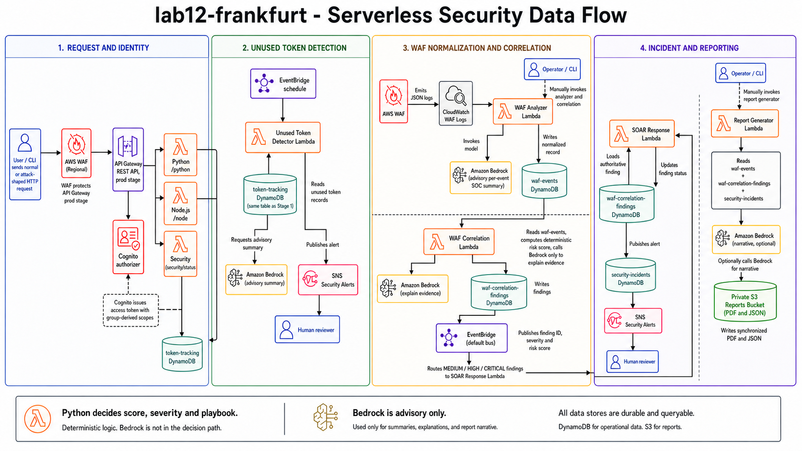

# lab12-frankfurt

`lab12-frankfurt` is a small serverless security lab running in AWS
`eu-central-1`. It starts with a Cognito-protected API, follows suspicious
requests through AWS WAF, turns the raw logs into useful security records, and
finishes with an incident and an executive PDF/JSON report.

The project is intentionally easy to explain: Python owns the security logic
and state changes; Amazon Bedrock only helps turn bounded evidence into readable
SOC and management summaries.



## What it demonstrates

- A regional AWS WAF protecting the API Gateway REST API `prod` stage.
- Cognito authentication, TOTP MFA, groups, and route-specific access-token
  scopes for `/python`, `/node`, and `/security/status`.
- Token issuance/use tracking plus scheduled unused-token detection.
- WAF JSON logging to CloudWatch and normalization into DynamoDB.
- Deterministic multi-event risk scoring with Bedrock used only for explanation.
- EventBridge routing from a stored finding to a SOAR response Lambda.
- Deterministic playbook selection, incident creation, and SNS notification.
- Synchronized PDF and JSON reports written to a private S3 bucket.

## Data flow

1. WAF evaluates requests before API Gateway passes them to Cognito and Lambda.
2. The analyzer reads recent WAF logs, writes normalized `waf-events` records,
   and asks Bedrock for a short per-event summary.
3. The correlation Lambda calculates its own score and severity, stores the
   finding, and publishes its ID and routing fields to the default EventBridge
   bus.
4. SOAR reloads the full finding from DynamoDB, chooses a fixed playbook,
   creates an incident, updates the finding, and publishes SNS.
5. The report Lambda reads events, findings, and incidents and writes matching
   PDF and JSON reports to private S3.

The analyzer, correlation, and report Lambdas are manual in this lab. That
keeps the order visible during a demo and avoids recurring Bedrock calls while
the environment is idle.

## Deploy

You need Terraform, AWS CLI v2, Python 3, Boto3, `jq`, `zip`, and access to an
appropriate Amazon Bedrock model.

```bash
cd terraform
export AWS_REGION=eu-central-1
export AWS_DEFAULT_REGION=eu-central-1

aws sts get-caller-identity
cp terraform.tfvars.example terraform.tfvars
${EDITOR:-nano} terraform.tfvars

./scripts/build-report-package.sh
terraform init
terraform fmt -recursive
terraform validate
terraform plan -out=lab12.tfplan
terraform apply lab12.tfplan
```

The default model is the EU geographic inference profile for Claude Haiku 4.5:

```text
eu.anthropic.claude-haiku-4-5-20251001-v1:0
```

Calls originate in Frankfurt but may be routed within the profile's documented
EU regions. Confirm account model access before deploying.

## Quick check

Export the deployed values:

```bash
export API_BASE_URL="$(terraform output -raw api_base_url)"
export ANALYZER="$(terraform output -raw waf_analyzer_function)"
export CORRELATOR="$(terraform output -raw waf_correlation_function)"
export REPORTER="$(terraform output -raw report_generator_function)"
```

A normal request without a token reaches Cognito and returns `401`. A valid
security token returns `200`. This encoded test request should be blocked by WAF
with `403`:

```bash
curl -i --get "$API_BASE_URL/python" \
  --data-urlencode 'name=<script>alert(1)</script>'
```

After WAF logs arrive, run the manual processing steps:

```bash
aws lambda invoke --region eu-central-1 \
  --function-name "$ANALYZER" \
  --cli-binary-format raw-in-base64-out \
  --payload '{}' /tmp/analyzer.json

aws lambda invoke --region eu-central-1 \
  --function-name "$CORRELATOR" \
  --cli-binary-format raw-in-base64-out \
  --payload '{"correlation_window_minutes":60}' /tmp/correlation.json

aws lambda invoke --region eu-central-1 \
  --function-name "$REPORTER" \
  --cli-binary-format raw-in-base64-out \
  --payload '{"report_period_hours":24}' /tmp/report.json
```

## Repository layout

- `terraform/` contains the deployable infrastructure and Lambda source.
- `provided/` contains the teacher-supplied code used by the lab.
- `assets/` contains the architecture diagram used above.

The most useful integration lessons were straightforward once visible:
Terraform and Python must agree on environment-variable names, DynamoDB needs
`Decimal` rather than Python `float`, EventBridge rules need an actual event
producer, and third-party Lambda packages must include their dependencies.

## Cost and cleanup

WAF, CloudWatch, API Gateway, Cognito, Lambda, DynamoDB, SNS, S3, EventBridge,
and Bedrock can incur charges. Keep test traffic small. When the environment is
no longer needed, review `terraform plan -destroy`, empty the versioned report
bucket, and run `terraform destroy`.
